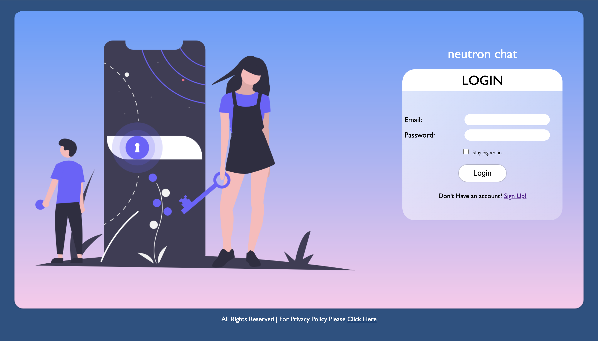
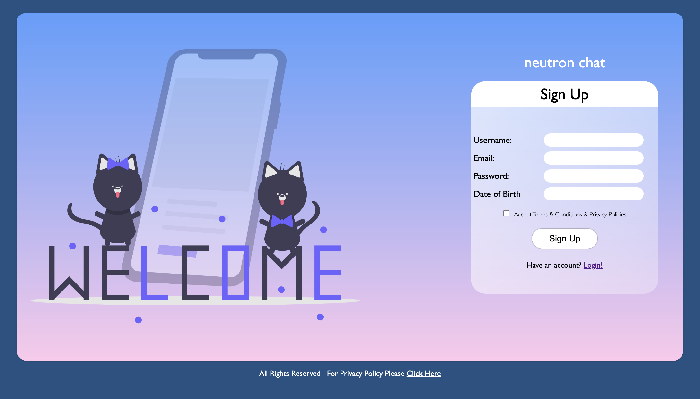
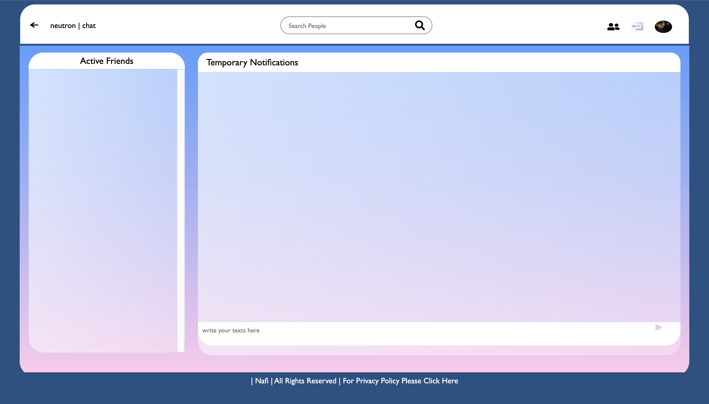
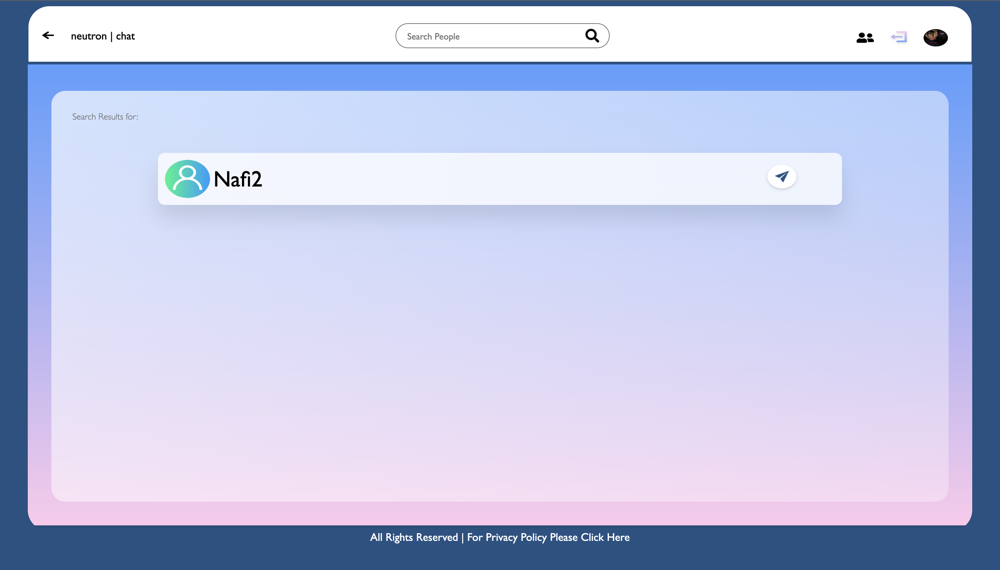
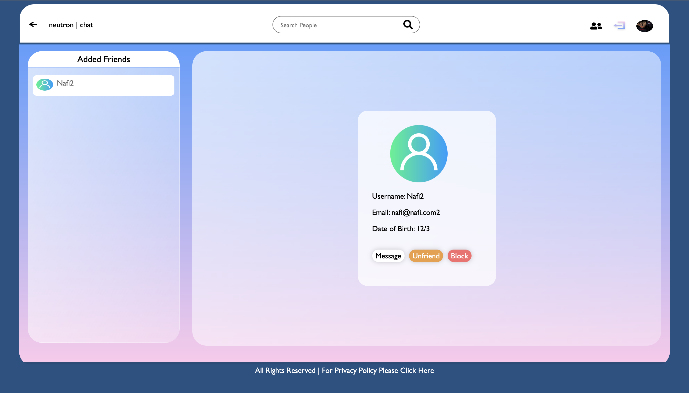
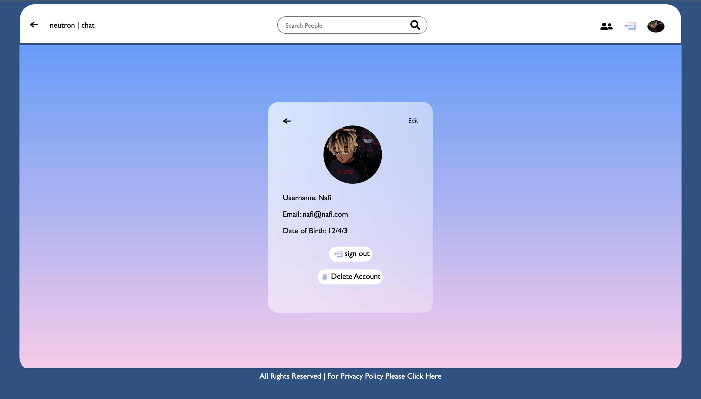

# How to setup

* Make a `.env` file on the project root directory, then copy the contents of the `example.env` onto the created `.env`  file. Fill in the blanks of the contents of it.

* Run `npm install` on the project root directory

* Run `node app.js` to run the application

* Go to the url `http://localhost:3000/login` on your browser. Done!!!

# Features

## Authentication system

The system hosts a secure authentication system. You can login using the credentials, that is already registered. 

The sign up page is secure since the passwords are encrypted, when stored. 

The login option is situated on the top navbar, when the user is logged in. 

## Home Page

You can search for users on the search bar to add them. If there are online friends, then they appear on the list on the side. The list updates dynamically, whenever a friend is online, and there is no need to refresh the browser. Click on that friend, and you can chat with them. The chats also update on real-time, and there is no refresh the browser. 

 

## Finding Users Page

The users can be searched for, on the search bar. Once clicked on the search icon, the people are listed matching the search query. Click on the button to add the user, to start chatting with them.

The friends that have been added, can be viewed through the icon on the top Navbar. Added friends can be unfriended, blocked, and chatted with. 

Your account can be deleted situated on one of the icon on the top navbar. 

